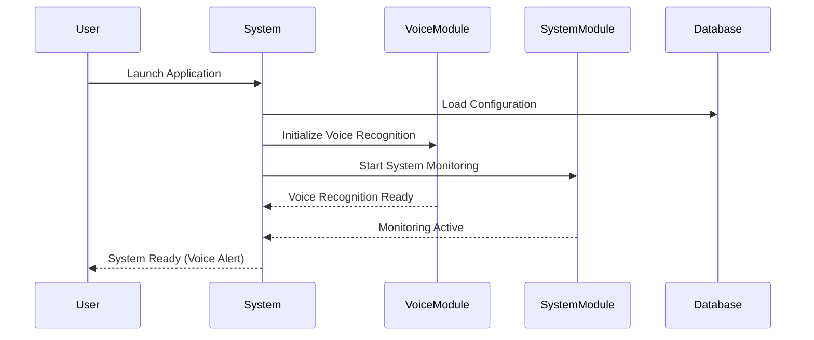
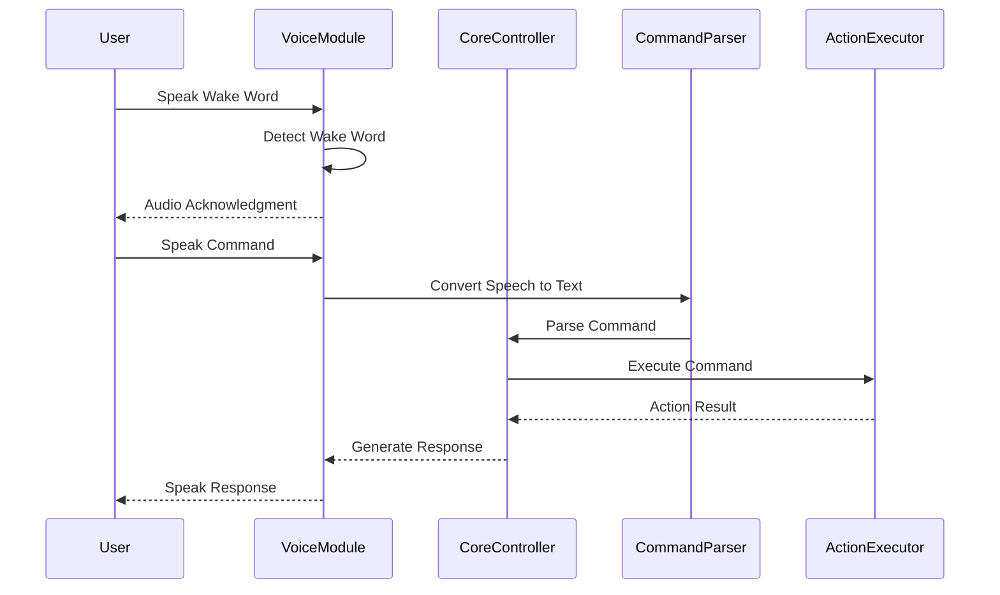
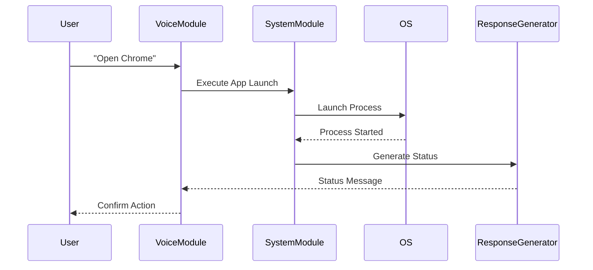
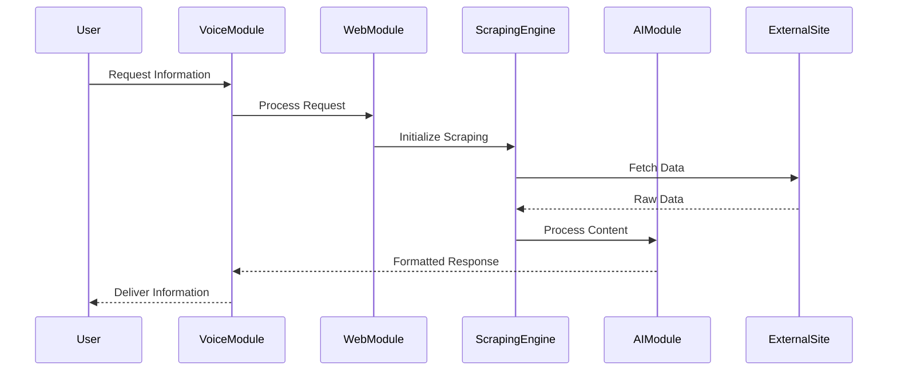
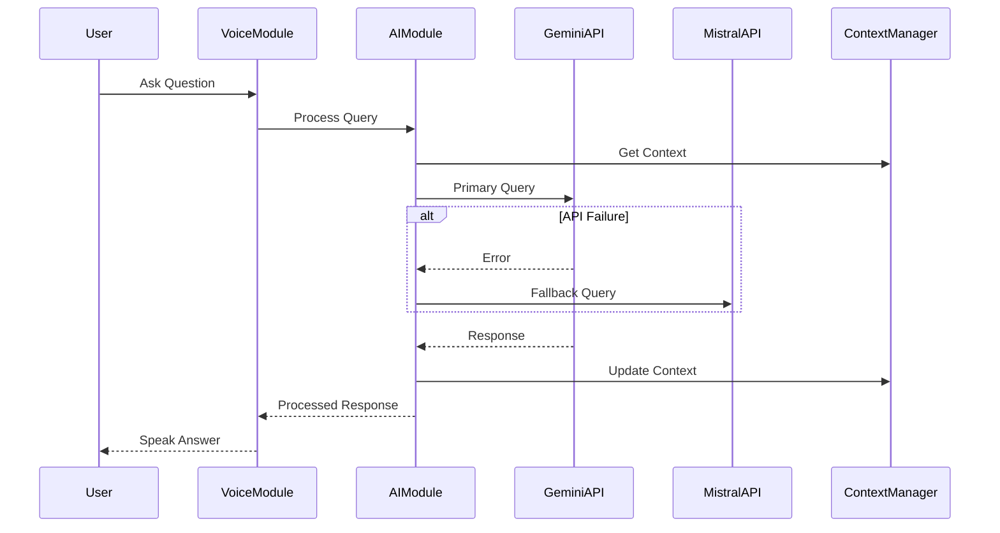
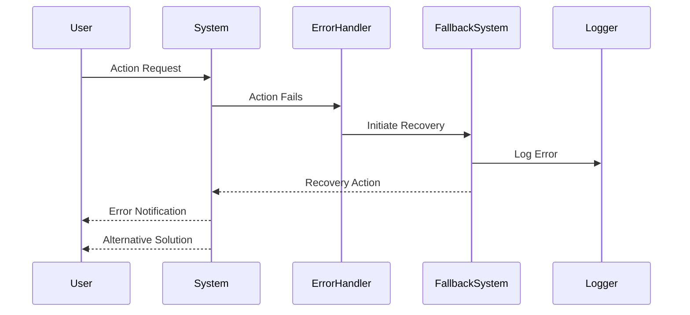
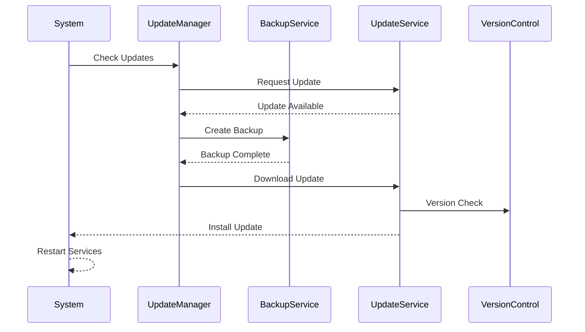
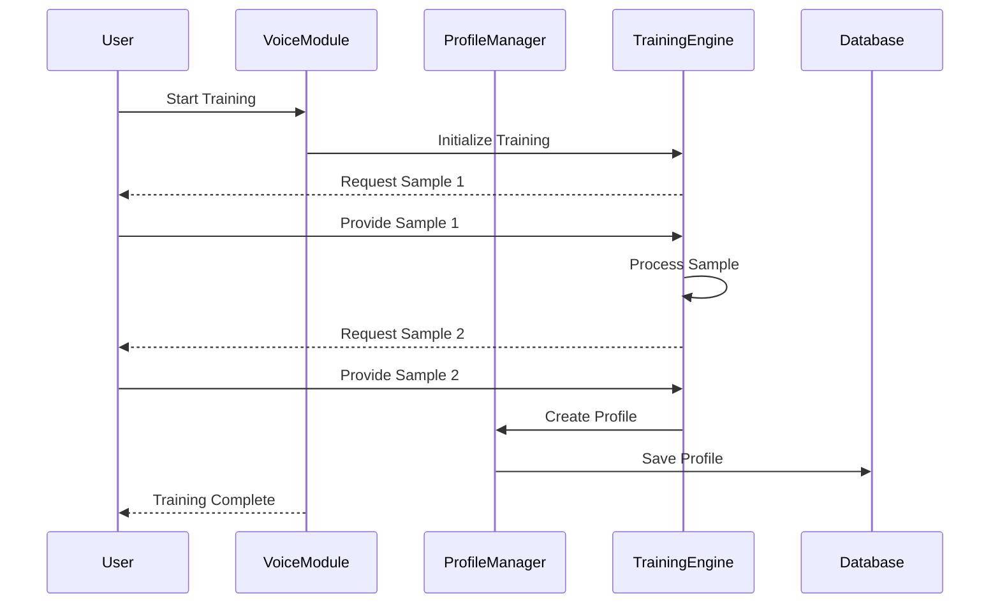

# Sequence Diagrams

## 1. System Initialization Sequence

## 2. Voice Command Processing Sequence

## 3. System Command Execution Sequence

## 4. Web Scraping Sequence

## 5. AI Query Processing Sequence

## 6. Error Handling Sequence

## 7. System Update Sequence

## 8. Voice Profile Training Sequence

## Note
These sequence diagrams represent the main flows of the system. Each component shown here corresponds to the modules and classes defined in the system architecture document (SAD.md). The interactions follow the principles of asynchronous operation and error handling as specified in the technical requirements.