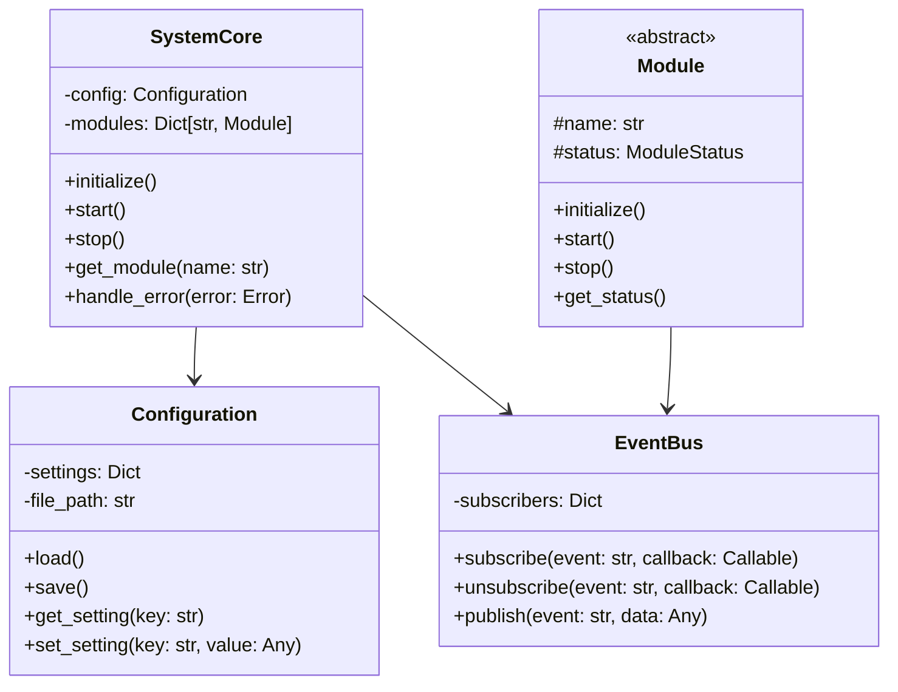
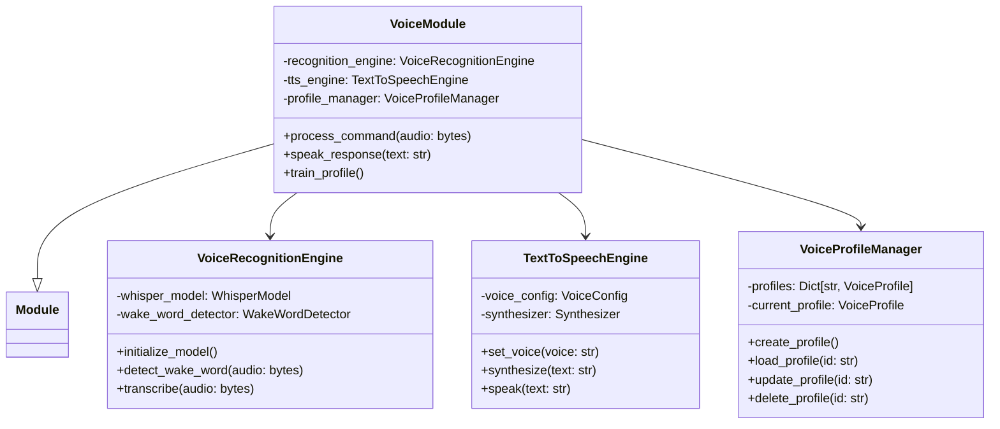
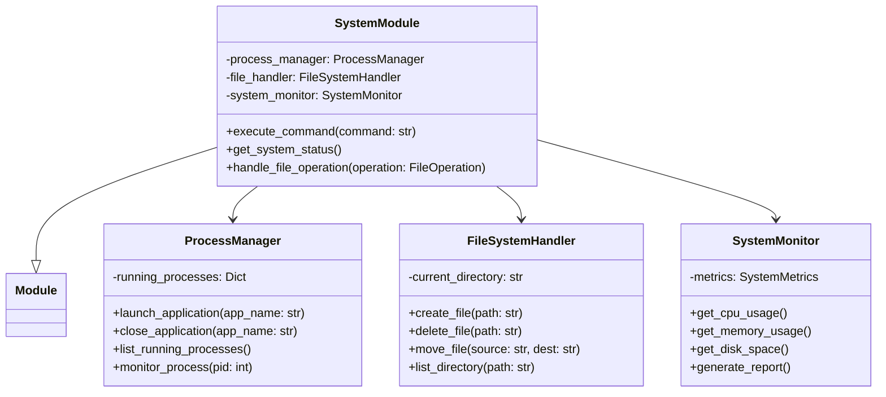
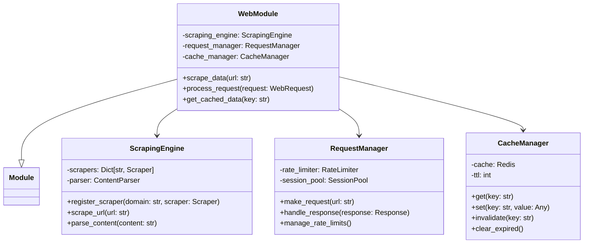
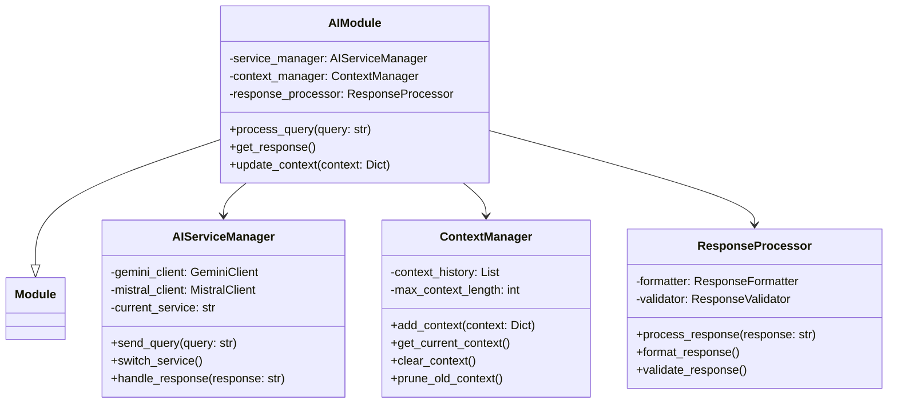
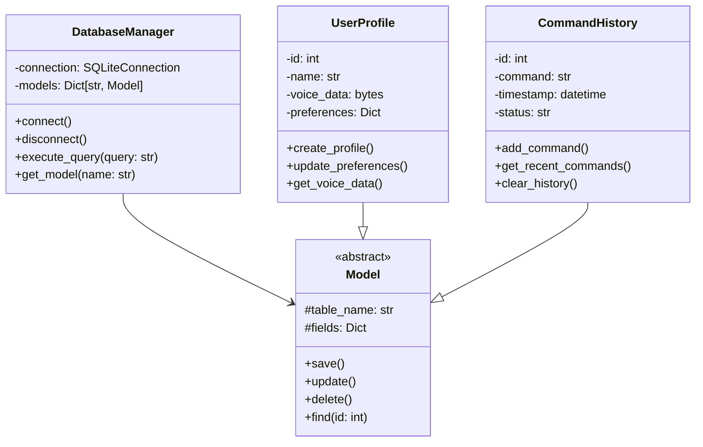
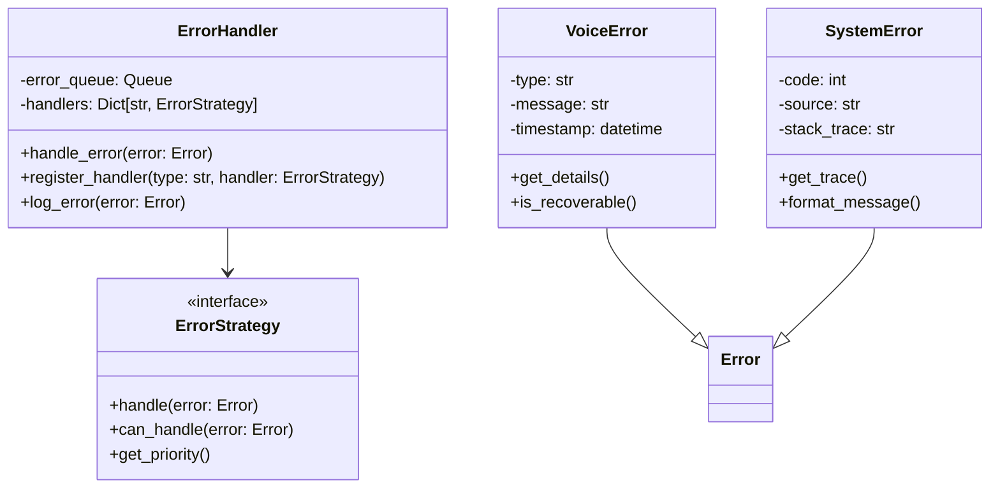

# Class Diagram

## Core System Classes

## Voice Module

## System Module

## Web Module

## AI Module

## Data Storage

## Error Handling

## Notes
- All classes implement appropriate interfaces and abstract classes
- Relationships shown:
  - Inheritance: --|>
  - Composition: -->
  - Implementation: ..|>
- Each module follows the dependency injection pattern
- Error handling is implemented across all classes
- Event-driven communication between modules
- Thread-safe implementations where necessary