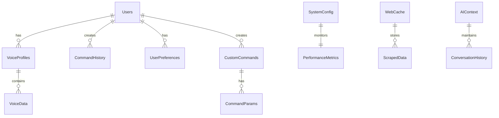

# Database Schema

## Overview
This schema defines the database structure for the voice-controlled Windows automation system. The database is implemented using SQLite for local storage and Redis for caching.

## Entity Relationship Diagram



## Table Definitions

### Users
```sql
CREATE TABLE users (
    user_id         INTEGER PRIMARY KEY AUTOINCREMENT,
    username        VARCHAR(50) NOT NULL UNIQUE,
    email          VARCHAR(100) UNIQUE,
    password_hash   VARCHAR(256) NOT NULL,
    created_at     TIMESTAMP DEFAULT CURRENT_TIMESTAMP,
    last_login     TIMESTAMP,
    is_active      BOOLEAN DEFAULT true,
    CONSTRAINT valid_email CHECK (email LIKE '%_@_%.__%')
);
```

### VoiceProfiles
```sql
CREATE TABLE voice_profiles (
    profile_id      INTEGER PRIMARY KEY AUTOINCREMENT,
    user_id         INTEGER NOT NULL,
    profile_name    VARCHAR(50) NOT NULL,
    wake_word       VARCHAR(50) NOT NULL,
    language        VARCHAR(10) DEFAULT 'en-US',
    created_at      TIMESTAMP DEFAULT CURRENT_TIMESTAMP,
    updated_at      TIMESTAMP,
    is_active       BOOLEAN DEFAULT true,
    FOREIGN KEY (user_id) REFERENCES users(user_id) ON DELETE CASCADE,
    UNIQUE (user_id, profile_name)
);
```

### VoiceData
```sql
CREATE TABLE voice_data (
    data_id         INTEGER PRIMARY KEY AUTOINCREMENT,
    profile_id      INTEGER NOT NULL,
    voice_sample    BLOB NOT NULL,
    sample_type     VARCHAR(20) NOT NULL,
    recorded_at     TIMESTAMP DEFAULT CURRENT_TIMESTAMP,
    duration_ms     INTEGER NOT NULL,
    sample_quality  FLOAT CHECK (sample_quality BETWEEN 0 AND 1),
    FOREIGN KEY (profile_id) REFERENCES voice_profiles(profile_id) ON DELETE CASCADE
);
```

### CommandHistory
```sql
CREATE TABLE command_history (
    command_id      INTEGER PRIMARY KEY AUTOINCREMENT,
    user_id         INTEGER NOT NULL,
    command_text    TEXT NOT NULL,
    execution_time  TIMESTAMP DEFAULT CURRENT_TIMESTAMP,
    duration_ms     INTEGER,
    status         VARCHAR(20) NOT NULL,
    error_message   TEXT,
    FOREIGN KEY (user_id) REFERENCES users(user_id) ON DELETE CASCADE
);
```

### UserPreferences
```sql
CREATE TABLE user_preferences (
    preference_id   INTEGER PRIMARY KEY AUTOINCREMENT,
    user_id         INTEGER NOT NULL,
    category        VARCHAR(50) NOT NULL,
    setting_key     VARCHAR(50) NOT NULL,
    setting_value   TEXT NOT NULL,
    updated_at      TIMESTAMP DEFAULT CURRENT_TIMESTAMP,
    FOREIGN KEY (user_id) REFERENCES users(user_id) ON DELETE CASCADE,
    UNIQUE (user_id, category, setting_key)
);
```

### CustomCommands
```sql
CREATE TABLE custom_commands (
    command_id      INTEGER PRIMARY KEY AUTOINCREMENT,
    user_id         INTEGER NOT NULL,
    command_name    VARCHAR(100) NOT NULL,
    command_type    VARCHAR(50) NOT NULL,
    script_content  TEXT NOT NULL,
    is_enabled      BOOLEAN DEFAULT true,
    created_at      TIMESTAMP DEFAULT CURRENT_TIMESTAMP,
    updated_at      TIMESTAMP,
    FOREIGN KEY (user_id) REFERENCES users(user_id) ON DELETE CASCADE,
    UNIQUE (user_id, command_name)
);
```

### CommandParams
```sql
CREATE TABLE command_params (
    param_id        INTEGER PRIMARY KEY AUTOINCREMENT,
    command_id      INTEGER NOT NULL,
    param_name      VARCHAR(50) NOT NULL,
    param_type      VARCHAR(20) NOT NULL,
    is_required     BOOLEAN DEFAULT false,
    default_value   TEXT,
    description     TEXT,
    FOREIGN KEY (command_id) REFERENCES custom_commands(command_id) ON DELETE CASCADE
);
```

### SystemConfig
```sql
CREATE TABLE system_config (
    config_id       INTEGER PRIMARY KEY AUTOINCREMENT,
    config_key      VARCHAR(50) NOT NULL UNIQUE,
    config_value    TEXT NOT NULL,
    data_type       VARCHAR(20) NOT NULL,
    description     TEXT,
    updated_at      TIMESTAMP DEFAULT CURRENT_TIMESTAMP,
    updated_by      INTEGER,
    FOREIGN KEY (updated_by) REFERENCES users(user_id)
);
```

### PerformanceMetrics
```sql
CREATE TABLE performance_metrics (
    metric_id       INTEGER PRIMARY KEY AUTOINCREMENT,
    timestamp       TIMESTAMP DEFAULT CURRENT_TIMESTAMP,
    cpu_usage       FLOAT NOT NULL,
    memory_usage    FLOAT NOT NULL,
    disk_usage      FLOAT NOT NULL,
    response_time   INTEGER,
    error_count     INTEGER DEFAULT 0,
    active_users    INTEGER DEFAULT 0
);
```

### WebCache
```sql
CREATE TABLE web_cache (
    cache_id        INTEGER PRIMARY KEY AUTOINCREMENT,
    url            TEXT NOT NULL,
    cache_key      VARCHAR(255) NOT NULL UNIQUE,
    content        TEXT NOT NULL,
    content_type   VARCHAR(50),
    cached_at      TIMESTAMP DEFAULT CURRENT_TIMESTAMP,
    expires_at     TIMESTAMP NOT NULL,
    last_accessed  TIMESTAMP,
    access_count   INTEGER DEFAULT 1
);
```

### ScrapedData
```sql
CREATE TABLE scraped_data (
    data_id         INTEGER PRIMARY KEY AUTOINCREMENT,
    cache_id        INTEGER,
    source_url      TEXT NOT NULL,
    data_type       VARCHAR(50) NOT NULL,
    content         TEXT NOT NULL,
    scraped_at      TIMESTAMP DEFAULT CURRENT_TIMESTAMP,
    processed       BOOLEAN DEFAULT false,
    FOREIGN KEY (cache_id) REFERENCES web_cache(cache_id) ON DELETE SET NULL
);
```

### AIContext
```sql
CREATE TABLE ai_context (
    context_id      INTEGER PRIMARY KEY AUTOINCREMENT,
    user_id         INTEGER NOT NULL,
    session_id      VARCHAR(100) NOT NULL,
    created_at      TIMESTAMP DEFAULT CURRENT_TIMESTAMP,
    updated_at      TIMESTAMP,
    is_active       BOOLEAN DEFAULT true,
    FOREIGN KEY (user_id) REFERENCES users(user_id) ON DELETE CASCADE
);
```

### ConversationHistory
```sql
CREATE TABLE conversation_history (
    message_id      INTEGER PRIMARY KEY AUTOINCREMENT,
    context_id      INTEGER NOT NULL,
    role            VARCHAR(20) NOT NULL,
    content         TEXT NOT NULL,
    timestamp       TIMESTAMP DEFAULT CURRENT_TIMESTAMP,
    tokens_used     INTEGER,
    FOREIGN KEY (context_id) REFERENCES ai_context(context_id) ON DELETE CASCADE
);
```

## Indexes

```sql
-- Performance optimization indexes
CREATE INDEX idx_voice_profiles_user ON voice_profiles(user_id);
CREATE INDEX idx_command_history_user ON command_history(user_id);
CREATE INDEX idx_command_history_time ON command_history(execution_time);
CREATE INDEX idx_web_cache_expiry ON web_cache(expires_at);
CREATE INDEX idx_conversation_context ON conversation_history(context_id);
CREATE INDEX idx_user_preferences_lookup ON user_preferences(user_id, category);
CREATE INDEX idx_custom_commands_user ON custom_commands(user_id);
CREATE INDEX idx_performance_metrics_time ON performance_metrics(timestamp);
```

## Views

```sql
-- Active user statistics
CREATE VIEW active_user_stats AS
SELECT 
    u.user_id,
    u.username,
    COUNT(ch.command_id) as total_commands,
    MAX(ch.execution_time) as last_command_time,
    COUNT(DISTINCT vp.profile_id) as voice_profiles_count
FROM users u
LEFT JOIN command_history ch ON u.user_id = ch.user_id
LEFT JOIN voice_profiles vp ON u.user_id = vp.user_id
WHERE u.is_active = true
GROUP BY u.user_id, u.username;

-- Command success rate
CREATE VIEW command_success_rate AS
SELECT 
    user_id,
    DATE(execution_time) as command_date,
    COUNT(*) as total_commands,
    SUM(CASE WHEN status = 'SUCCESS' THEN 1 ELSE 0 END) as successful_commands,
    CAST(SUM(CASE WHEN status = 'SUCCESS' THEN 1 ELSE 0 END) AS FLOAT) / COUNT(*) as success_rate
FROM command_history
GROUP BY user_id, DATE(execution_time);

-- System performance overview
CREATE VIEW system_performance_daily AS
SELECT 
    DATE(timestamp) as metric_date,
    AVG(cpu_usage) as avg_cpu,
    MAX(cpu_usage) as max_cpu,
    AVG(memory_usage) as avg_memory,
    MAX(memory_usage) as max_memory,
    SUM(error_count) as total_errors
FROM performance_metrics
GROUP BY DATE(timestamp);
```

## Notes
1. All tables include appropriate constraints and foreign keys
2. Timestamps are stored in UTC
3. Sensitive data (voice samples, passwords) should be encrypted
4. Regular maintenance required for cache and history tables
5. Implement appropriate backup strategies
6. Consider partitioning large tables (command_history, performance_metrics)
7. Monitor index usage and optimize as needed
8. Implement proper access control and data validation